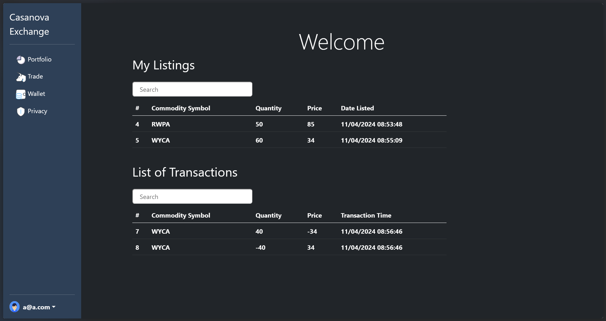
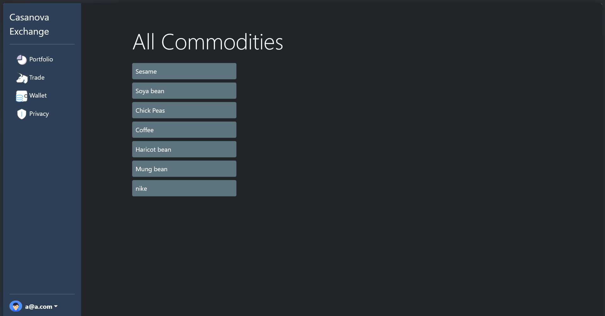
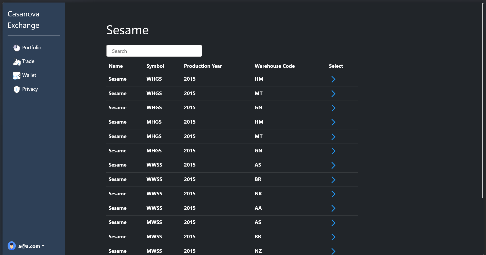

# CasanovaExchange

CasanovaExchange is a commodity exchange platform built with ASP.NET Core MVC. Inspired by the **Ethiopian Commodity Exchange (ECX)**, this application simulates a marketplace where buyers and sellers can trade agricultural commodities such as seeds, coffee, and beans.

## 📌 Project Overview

The goal of this project is to modernize and digitize the trading of agricultural products. It provides a platform for users to view market data, manage their portfolios, and execute trades in a transparent and efficient manner.

### Key Features
*   **Commodity Trading**: Buy and sell various agricultural commodities including:
    *   Coffee
    *   Sesame
    *   Chickpeas
    *   Haricot Beans
    *   Soya Beans
    *   Mung Beans
*   **Real-time Market Data**: View daily trade data including Open, High, Low, Close, and Volume statistics.
*   **Warehouse Management**: Track commodities stored in different warehouses.
*   **User Accounts & Wallet**: Secure user authentication and a digital wallet system for managing funds and assets.
*   **Admin Dashboard**: Tools for administrators to manage listings and users.

##  🖼️ Screenshots


*Exchange Dashboard*


*Market Overview*


*Sesame Market Listings*

## ⚙️ Tech Stack

*   **Framework**: ASP.NET Core MVC (.NET 6/7)
*   **Database**: SQL Server
*   **ORM**: Entity Framework Core
*   **Authentication**: ASP.NET Core Identity
*   **Frontend**: Razor Views, HTML, CSS, JavaScript, Bootstrap

## 🚀 Getting Started

### Prerequisites
*   [.NET SDK](https://dotnet.microsoft.com/download) (Version 6.0 or later)
*   [SQL Server](https://www.microsoft.com/en-us/sql-server/sql-server-downloads) (LocalDB or Express)
*   Visual Studio or VS Code

### Installation

1.  **Clone the repository**
    ```bash
    git clone https://github.com/EtsubFikreab/CasanovaExchange.git
    cd CasanovaExchange
    ```

2.  **Configure the Database**
    Update the connection string in `CasanovaExchange/appsettings.Development.json` to point to your local SQL Server instance:
    ```json
    "ConnectionStrings": {
      "CommodityConnection": "Server=(localdb)\\mssqllocaldb;Database=CasanovaExchangeDb;Trusted_Connection=True;MultipleActiveResultSets=true"
    }
    ```

3.  **Run Migrations**
    Apply the Entity Framework migrations to create the database schema:
    ```bash
    cd CasanovaExchange
    dotnet ef database update
    ```

4.  **Run the Application**
    ```bash
    dotnet run
    ```
    Navigate to `https://localhost:5001` (or the port indicated in the terminal) to view the application.

## 📂 Project Structure

*   **/Controllers**: Handles the application logic (Account, Trade, Wallet, etc.).
*   **/Models**: Defines the data structures (Commodity, Trade, Wallet, User).
*   **/Views**: The user interface (Razor pages).
*   **/Repository**: Data access layer implementing the Repository pattern.
*   **/Data**: Contains seed data/historical records for commodities.
*   **/wwwroot**: Static assets like CSS, JavaScript, and images.

## 💡 Inspiration

This project draws inspiration from the **Ethiopian Commodity Exchange (ECX)**, a tailored marketplace that serves the specific needs of the Ethiopian economy by providing a reliable, transparent, and efficient marketing system for agricultural products.
